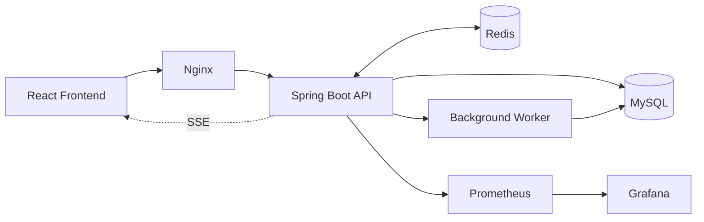
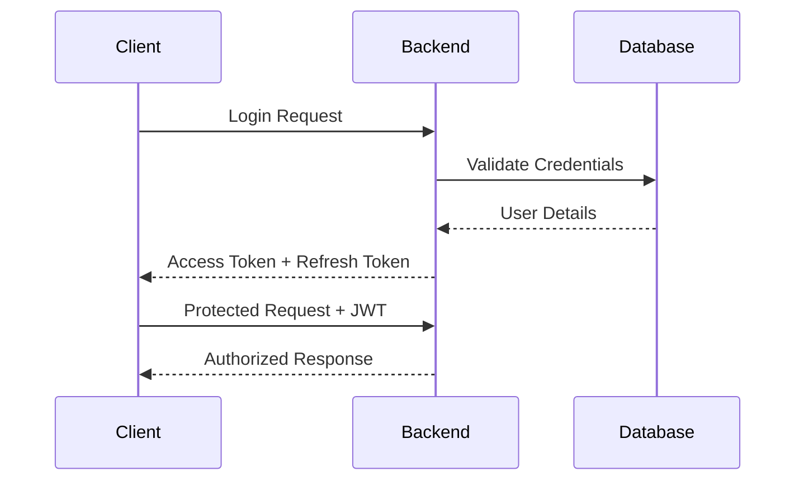
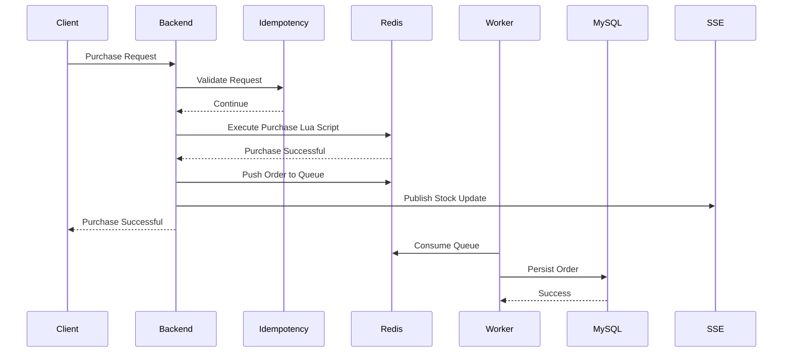
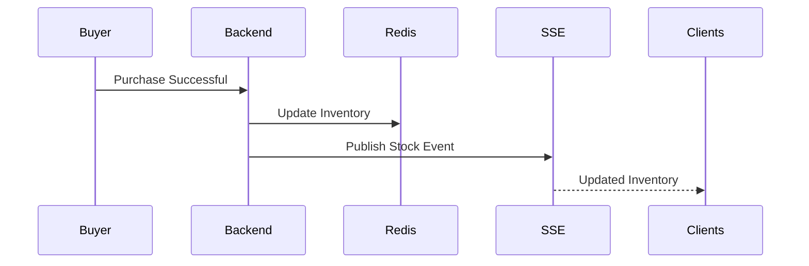
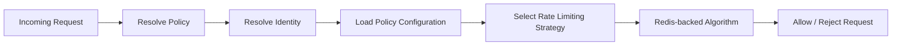
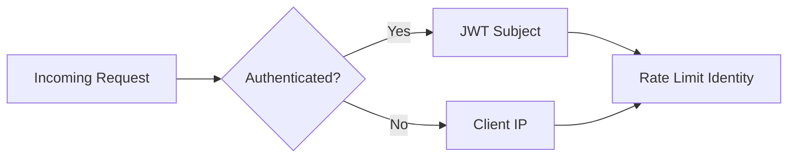
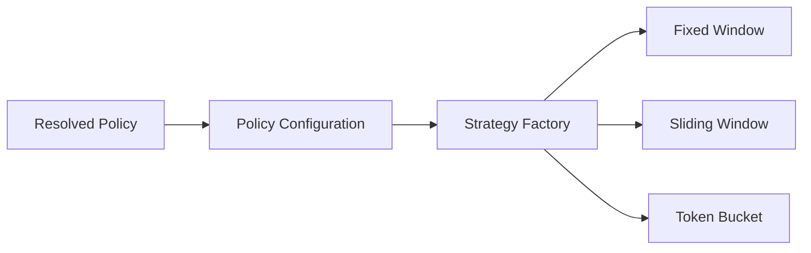
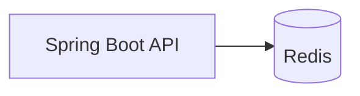

# System Architecture

## 1. Purpose

The Flash Sale Engine & API Rate Limiting Gateway was built to explore how modern backend systems solve high-concurrency problems while remaining maintainable, scalable, and observable.

This document describes the architecture of the system from an engineering perspective. Rather than focusing on implementation details, it explains how the major components collaborate, the responsibilities assigned to each subsystem, and the architectural principles that guided the overall design.

Throughout the project, every significant architectural decision was made to address a specific engineering problem—whether preventing overselling, protecting APIs from abusive traffic, safely handling duplicate requests, or designing the application so it can support horizontal scaling. Those decisions are introduced here at a high level. Detailed implementation notes, engineering trade-offs, validation evidence, and Architecture Decision Records (ADRs) are maintained separately to keep this document focused on the overall system design.

The architecture intentionally favors clear separation of responsibilities, stateless application services, distributed shared state, and evidence-driven engineering. Every major design decision is supported by implementation, automated tests, benchmarks, operational metrics, or documented rationale rather than assumptions.

> **Why this matters**
>
> Understanding a system requires more than reading its source code. By documenting the responsibilities, interactions, and reasoning behind each architectural decision, this document provides the context needed to understand not only how the system works, but why it was designed this way.

## 2. Architectural Principles

The architecture is guided by a small set of engineering principles that influenced every major design decision throughout the project. Rather than being isolated concepts, these principles work together to shape how requests are processed, how state is managed, and how the system evolves over time.

---

### 1. Stateless Application Layer

Application instances are designed to remain stateless. Any state that must be shared across requests or backend instances is stored externally rather than inside application memory.

This allows multiple backend instances to process requests interchangeably without relying on sticky sessions or instance-specific data. Authentication remains stateless through JWTs, while Redis serves as the shared state store for concurrency-sensitive operations.

> **Why this matters**
>
> Stateless services simplify horizontal scaling, improve fault tolerance, and ensure that requests can be routed to any healthy backend instance without affecting correctness.

---

### 2. Separation of Responsibilities

Each subsystem is responsible for solving a single engineering problem. Authentication verifies identity, rate limiting protects APIs, idempotency guarantees safe retries, the flash sale engine enforces business rules, asynchronous workers handle persistence, and observability provides operational visibility.

Keeping responsibilities isolated reduces coupling between components and allows individual subsystems to evolve without introducing unnecessary complexity elsewhere in the application.

> **Why this matters**
>
> Clearly defined boundaries improve maintainability, simplify testing, and make architectural decisions easier to reason about as the project grows.

---

### 3. Distributed Shared State

Concurrency-sensitive data is treated as shared system state rather than application-local state. Components that coordinate concurrent requests rely on a centralized state store, while durable business data is maintained separately within the persistence layer.

This separation distinguishes transient coordination state from long-term business records, allowing each type of data to be managed by the technology best suited to its requirements.

> **Why this matters**
>
> Centralizing distributed state allows the system to scale horizontally while preserving correctness and consistency across multiple application instances.

---

### 4. Correctness Before Optimization

Operations that affect business correctness always prioritize consistency over raw throughput. Inventory updates, purchase validation, and idempotent request handling are designed to execute atomically before considering performance optimizations.

Performance improvements such as asynchronous persistence and in-memory coordination are introduced only after correctness guarantees are established.

> **Why this matters**
>
> Optimizing an incorrect system simply produces incorrect results faster. Establishing correctness first provides a reliable foundation for future scalability improvements.

---

### 5. Evidence-Driven Engineering

Architectural decisions are supported by implementation, automated tests, concurrency validation, benchmarking, operational metrics, and documentation. Features are introduced to solve identifiable engineering problems rather than to demonstrate technologies.

When limitations exist, they are documented explicitly rather than hidden behind assumptions or future intentions.

> **Why this matters**
>
> Engineering decisions become more valuable when they are supported by measurable evidence. This approach makes the architecture easier to evaluate, reproduce, and extend over time.

## 3. System Overview

The Flash Sale Engine & API Rate Limiting Gateway combines two complementary backend systems into a single platform that addresses different aspects of high-concurrency request processing.

The **API Rate Limiting Gateway** protects backend services by enforcing configurable request policies based on endpoints, user roles, and runtime-selected rate limiting algorithms. Instead of embedding traffic control into individual services, rate limiting is treated as a dedicated infrastructure concern backed by Redis.

The **Flash Sale Engine** focuses on maintaining correctness under concurrent purchase requests. It coordinates inventory management, purchase validation, idempotent request handling, asynchronous order persistence, and real-time inventory updates while ensuring that limited stock cannot be oversold.

Although each subsystem solves a different problem, they share the same architectural principles. Both rely on stateless application services, Redis as the distributed coordination layer, MySQL as the persistent system of record, and supporting operational components for monitoring, deployment, and scalability.

The following diagram provides a high-level view of the major components and their relationships.

> **Why this matters**
>
> Separating the platform into focused subsystems keeps individual responsibilities clear while allowing shared infrastructure such as Redis, MySQL, and observability components to support the entire application. This approach makes the system easier to understand, extend, and validate as new capabilities are introduced.

## 4. System Components

The platform is composed of a small number of well-defined components, each responsible for solving a specific engineering problem. By assigning a single primary responsibility to each component, the architecture remains modular, easier to reason about, and simpler to evolve as new capabilities are introduced.

| Component | Primary Responsibility |
|------------|------------------------|
| **React Frontend** | Provides the user interface for authentication, administration, purchasing, and real-time inventory updates. |
| **Nginx** | Serves as the entry point to the platform, routing incoming requests to backend instances and enabling horizontal scaling. |
| **Spring Boot Backend** | Implements authentication, business logic, rate limiting, purchase processing, idempotency, and exposes APIs consumed by the frontend. |
| **Redis** | Acts as the distributed coordination layer for concurrency-sensitive operations including rate limiting, inventory management, idempotency, asynchronous queues, and Pub/Sub messaging. |
| **MySQL** | Serves as the persistent system of record for users, products, sales, and completed purchase orders. |
| **Background Worker** | Processes asynchronous purchase events and persists successful orders to MySQL without blocking client requests. |
| **Prometheus** | Collects application and infrastructure metrics for monitoring and performance analysis. |
| **Grafana** | Visualizes metrics through dashboards to provide operational insight into system behavior under load. |

> **Why this matters**
>
> Assigning clear responsibilities to each component keeps the architecture modular and reduces unnecessary coupling between subsystems. Rather than allowing every component to solve multiple concerns, each service focuses on a well-defined responsibility, making the system easier to understand, test, maintain, and scale.

## 5. Request Lifecycle

Understanding the platform requires more than knowing which components exist—it requires understanding how they collaborate while processing requests.

Although different endpoints perform different business operations, every request follows the same architectural pipeline. Requests enter through the reverse proxy, are authenticated, evaluated against security and rate limiting policies, and only then reach the business layer.

Operations that require strong consistency, such as purchases, continue through additional coordination steps including idempotency validation, atomic inventory updates, asynchronous persistence, and real-time event publication.

The following sections illustrate the request lifecycle for the three primary interaction patterns implemented by the system:

- Authentication requests
- Purchase requests
- Real-time inventory updates

### Authentication Request

Authentication establishes the identity of the client before any protected resources can be accessed. Rather than maintaining user sessions on the server, the application issues JSON Web Tokens (JWTs) after successful authentication. Subsequent requests present the token, allowing every backend instance to validate requests independently.

This approach keeps the application layer stateless while eliminating the need for session replication between backend instances.

> **Why this matters**
>
> Stateless authentication allows requests to be processed by any backend instance without relying on server-side sessions. This simplifies horizontal scaling while reducing operational complexity.

> **Related ADR**
>
> ADR-006 — Authentication & Authorization *(Planned)*

### 5.2 Purchase Request

The purchase workflow is the most concurrency-sensitive operation in the system. During a flash sale, multiple users may attempt to purchase the same limited inventory simultaneously. The architecture is designed to guarantee correctness under concurrent load while keeping the request path lightweight and responsive.

Before inventory is modified, the request passes through authentication, rate limiting, and idempotency validation. Once these checks succeed, the Flash Sale Engine executes a Redis Lua script that atomically validates inventory availability, enforces per-user purchase limits, and reserves stock. If the purchase succeeds, the request is acknowledged immediately while order persistence is delegated to a background worker through an asynchronous Redis queue. Inventory changes are simultaneously published to connected clients using Server-Sent Events (SSE).

> **Why this matters**
>
> Separating inventory reservation from database persistence minimizes request latency while preserving correctness. Atomic Redis execution prevents overselling under concurrent load, asynchronous persistence keeps the purchase path responsive, and SSE ensures every connected client receives inventory updates without polling.

> **Related ADR**
>
> ADR-002 — Atomic Purchase Flow *(Planned)*

### 5.3 Real-Time Inventory Updates

During a flash sale, inventory changes continuously as purchases succeed. Requiring every client to repeatedly poll the server for updated stock would generate unnecessary network traffic and increase backend load, particularly during periods of high demand.

To provide immediate feedback while keeping the communication model lightweight, the application uses **Server-Sent Events (SSE)**. Clients establish a persistent connection when entering the purchase workspace. Whenever inventory changes, the backend publishes an update that is streamed directly to every subscribed client without requiring additional requests.

> **Why this matters**
>
> Using Server-Sent Events allows the server to push inventory updates only when changes occur, eliminating unnecessary polling while ensuring every connected client observes inventory changes almost immediately. This improves both user experience and backend efficiency during high-concurrency events.

## 6. API Protection Architecture

Protecting an API involves more than limiting the number of requests a client can send. Different endpoints serve different purposes and operate under different constraints. Authentication endpoints must resist brute-force attacks, purchase endpoints must remain stable during flash sales, administrative operations require different protection policies than public APIs, and general application traffic should not be constrained by rules designed for high-value transactions.

Applying a single rate limiting algorithm across every endpoint would ignore these differences, forcing one strategy to solve fundamentally different problems.

To address this, the application implements a **policy-driven API protection architecture**. Instead of coupling endpoints directly to a specific algorithm, each endpoint is assigned a **rate limiting policy** that describes how requests should be protected. The policy defines request limits, window sizes, burst capacity, refill behavior, and the rate limiting algorithm to execute. During request processing, the application resolves the appropriate policy, selects the corresponding strategy at runtime, and delegates enforcement to the selected implementation. This entire workflow is executed transparently by the request interception layer before the request reaches the business logic, allowing controllers to remain focused solely on application behavior.

This architecture separates **policy definition** from **algorithm implementation**, allowing protection rules to evolve through configuration without requiring changes to application code.

> **Why this matters**
>
> Treating API protection as a policy-driven subsystem rather than a collection of independent algorithms keeps the architecture flexible and maintainable. Endpoint behavior can evolve by changing policies instead of modifying business logic, while new algorithms can be introduced without affecting request processing or controller implementations.

> **Related ADR**
>
> ADR-001 — Runtime-Configurable API Protection *(Planned)*

### 6.1 Policy-Driven Request Classification

Every incoming request must first be classified before an appropriate protection strategy can be applied. Rather than hardcoding rate limiting rules around URL patterns or controller implementations, the application classifies requests using explicit rate limiting policies.

Controllers and individual endpoints declare their required protection through the `@RateLimit` annotation. During request interception, the `RateLimitPolicyResolver` inspects the handler method to determine which policy should govern the request. Method-level annotations take precedence over controller-level annotations, allowing individual endpoints to override broader controller defaults when necessary. If no annotation is present, the request is assigned the `GENERAL` policy.

This approach decouples endpoint behavior from implementation details. Controllers simply express the level of protection they require, while the API protection subsystem determines how that policy should be enforced.

Current policies implemented by the system include:

| Policy | Intended Use |
|----------|--------------|
| **AUTH** | Authentication endpoints that require protection against brute-force attacks. |
| **TRANSACTION** | Purchase operations where controlled traffic and fairness are critical. |
| **GENERAL** | Default protection applied to standard application endpoints. |
| **ADMIN** | Administrative operations with higher throughput requirements for privileged users. |

> **Why this matters**
>
> Separating endpoint classification from enforcement keeps controllers free from infrastructure concerns. New endpoints can adopt existing protection policies—or introduce new ones—without modifying the rate limiting implementation itself, making the system easier to evolve and maintain.

### 6.2 Identity Resolution

Once a request has been classified, the application determines **who** the rate limit should be applied to. Rather than binding the implementation to a single identity source, the API protection layer resolves a rate limiting identity before any algorithm is executed.

For authenticated requests, the identity is derived from the authenticated JWT subject, ensuring that limits follow the user regardless of the client or backend instance processing the request. For unauthenticated requests, where no user identity exists, the client IP address becomes the fallback identity.

This produces a consistent identity model for every request while allowing the underlying rate limiting algorithms to remain completely independent of authentication mechanisms.

| Request Type | Identity Used |
|--------------|---------------|
| Authenticated User | JWT Subject (User ID) |
| Anonymous Request | Client IP Address |

By resolving identity before algorithm selection, every rate limiting strategy operates on the same abstraction rather than dealing with authentication or HTTP-specific concerns.

> **Why this matters**
>
> Separating identity resolution from rate limiting algorithms keeps each strategy focused solely on enforcing limits. Authentication concerns remain isolated within the security layer, while the rate limiting subsystem simply receives a unified identity regardless of how it was resolved.

### 6.3 Runtime Strategy Selection

Once the request policy and client identity have been resolved, the application determines **how** the request should be evaluated. Rather than binding each policy to a specific implementation at compile time, the API protection layer selects the appropriate rate limiting strategy during request processing.

Each policy is backed by external configuration that defines the algorithm to execute together with its operational characteristics, including request limits, window duration, burst capacity, and refill rate where applicable. The `RateLimiterService` loads the policy configuration and delegates execution to the `StrategyFactory`, which returns the appropriate algorithm implementation.

This allows the protection behavior of an endpoint to evolve without modifying application code. Changing an endpoint from a Fixed Window policy to a Sliding Window policy, or introducing different limits for administrative endpoints, becomes a configuration change rather than a software change.

Current policy configuration:

| Policy | Algorithm | Primary Use |
|----------|-----------|-------------|
| **AUTH** | Sliding Window | Authentication endpoints |
| **TRANSACTION** | Token Bucket | Purchase operations |
| **GENERAL** | Fixed Window | General application traffic |
| **ADMIN** | Token Bucket | Administrative operations |

Unlike traditional implementations where a single algorithm protects every endpoint, the architecture allows different parts of the application to adopt protection strategies that better match their traffic characteristics and operational requirements.

> **Why this matters**
>
> Separating policy configuration from algorithm implementation makes the rate limiting subsystem both extensible and configurable. New algorithms can be introduced without modifying existing request processing, while operational teams can adjust protection policies through configuration rather than application code.

### 6.4 Distributed Rate Limiting

The API protection subsystem is designed so that rate limiting state resides entirely within Redis rather than application memory. Although the current deployment targets a single backend instance, storing counters and coordination data in Redis establishes a shared source of truth that avoids process-local state and prepares the subsystem for future horizontal scaling.

Each rate limiting strategy persists its operational state using Redis structures that best match its coordination requirements.

| Algorithm | Redis Data Structure | Coordination Strategy |
|-----------|----------------------|-----------------------|
| **Fixed Window** | String Counter | Atomic Redis increment with key expiration |
| **Sliding Window** | Sorted Set | Lua script for atomic window cleanup, insertion, and counting |
| **Token Bucket** | Redis Hash | Lua script for atomic token refill and consumption |

Algorithms that require multiple Redis operations execute through Lua scripts so that validation and state updates occur atomically. This eliminates race conditions that could otherwise appear under concurrent load while reducing network round trips between the application and Redis.

Redis key construction is standardized across all strategies, ensuring consistent namespacing for policies, identities, and algorithm-specific state.

> **Why this matters**
>
> Centralizing rate limiting state in Redis keeps the application layer stateless and provides a consistent foundation for request coordination. Because enforcement no longer depends on process-local memory, the architecture is prepared for future horizontal scaling without requiring changes to the rate limiting subsystem.

> **Current Scope**
>
> The architecture has been validated in a single-backend deployment. Validation of multi-instance behavior behind Nginx is planned as part of the horizontal scaling milestone before the v1.0 release.